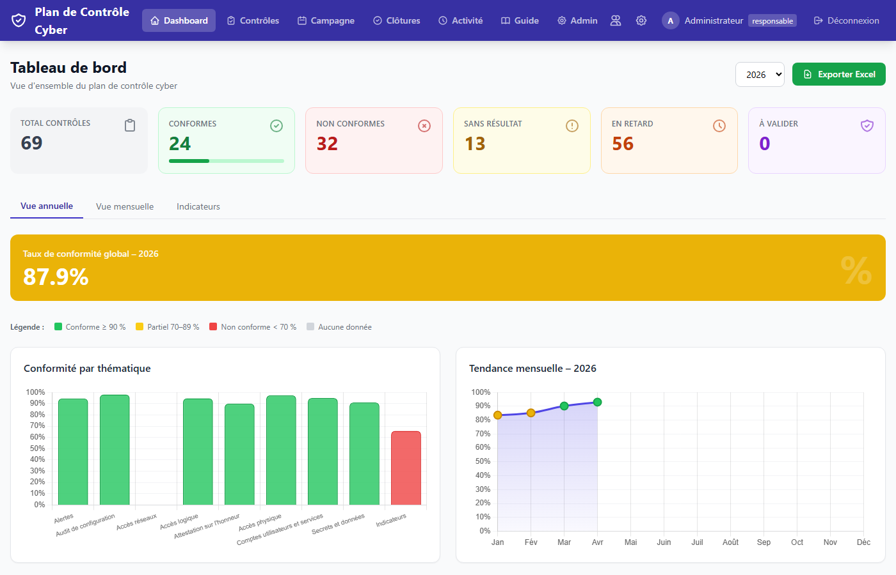
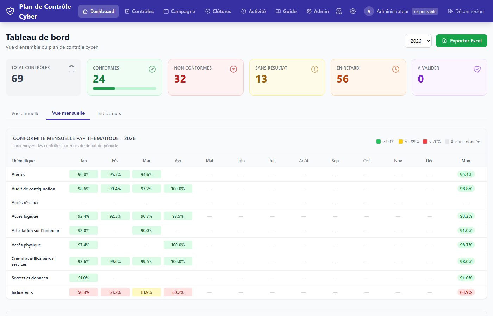
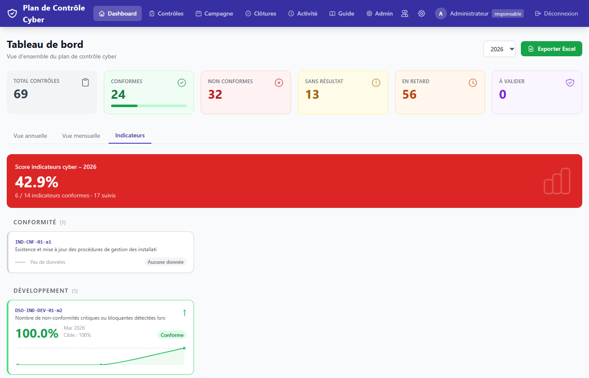
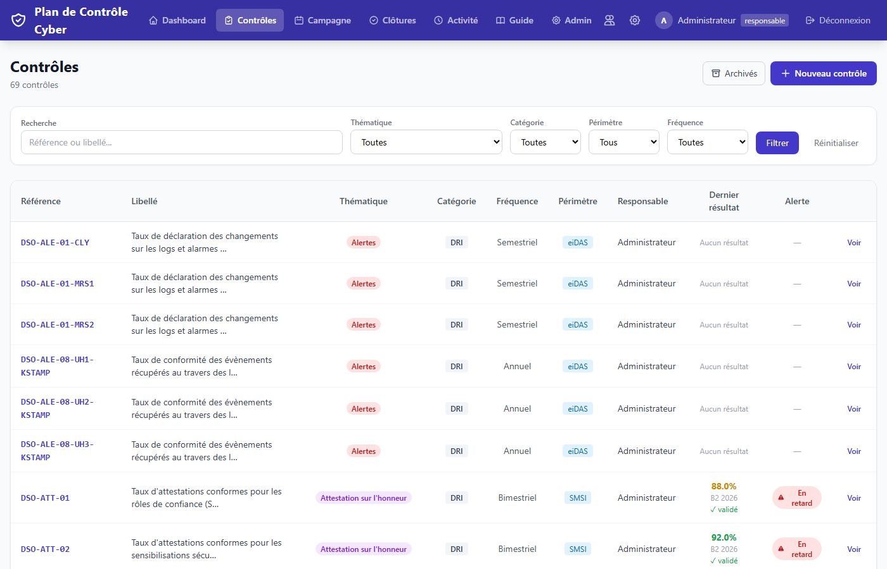
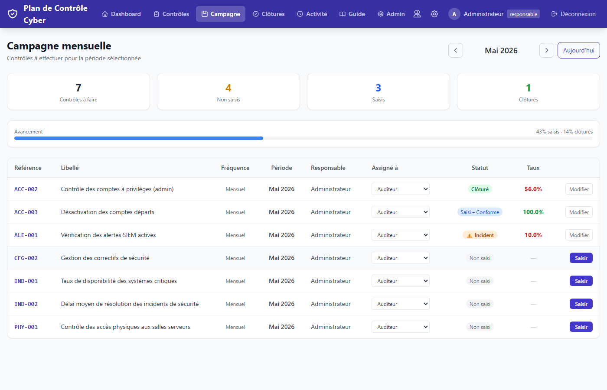
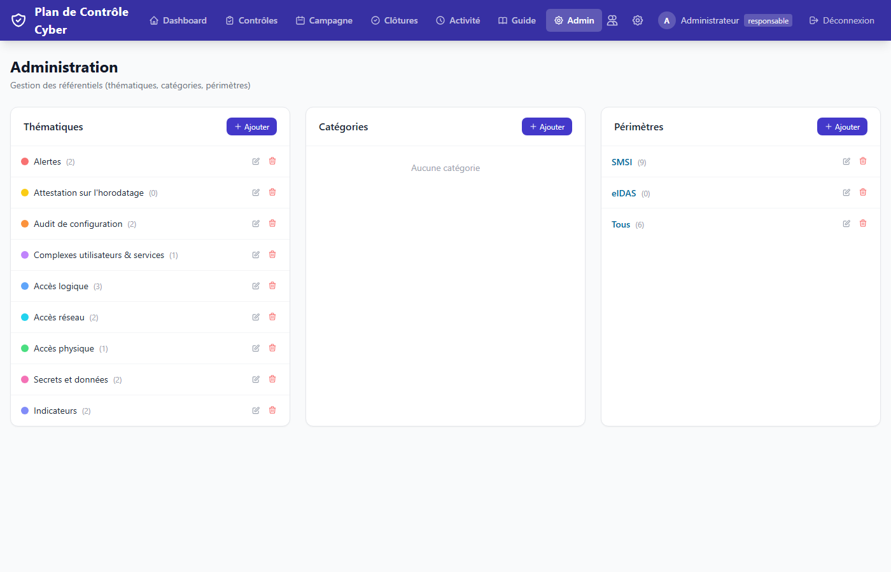

# Plan de Contrôle Cyber


Application de gestion du plan de contrôle cybersécurité — suivi des contrôles, saisie des résultats, gestion des incidents, tableau de bord de conformité, et **plugins d'automatisation** pour les contrôles récurrents.

Déploiement local Windows ou Docker, aucune dépendance cloud.

---

## Aperçu

| Tableau de bord — Vue annuelle | Vue mensuelle |
|:---:|:---:|
|  |  |

| Cockpit Indicateurs | Liste des contrôles |
|:---:|:---:|
|  |  |

| Campagne mensuelle | Administration |
|:---:|:---:|
|  |  |

---

## Fonctionnalités

- **Référentiel de contrôles** — création et gestion des contrôles avec référence, libellé, indicateur, objectif, fréquence, taux cible et lien vers le guide/procédure
- **Campagne mensuelle** — vue des contrôles à réaliser pour le mois en cours, avec assignation des auditeurs par le responsable
- **Planification annuelle** — création en masse de toutes les périodes d'un contrôle pour l'année, avec assignation par période
- **Saisie des résultats** — formulaire de saisie du taux de conformité par période, statut automatique (conforme / non conforme / NA)
- **Plugins d'automatisation** — associez un plugin à un contrôle pour l'analyser automatiquement ; le panneau plugin apparaît dans le formulaire de résultat pour lancer, consulter et valider en un seul flux
- **Workflow incident** — ouverture d'un incident depuis un résultat non conforme (avec ou sans ticket EasyVista), suivi de l'état (en cours / résolu / clôturé)
- **Clôtures en attente** — file de validation des résultats soumis par les auditeurs
- **Tableau de bord** — trois onglets : *Vue annuelle* (KPIs, graphiques, top 10 contrôles les moins performants), *Vue mensuelle* (heatmap thématique × mois, top 10 du mois courant), *Indicateurs* (cockpit exécutif cyber avec cartes groupées par domaine, tendance et mini-graphiques)
- **Journal d'activité** — toutes les actions tracées avec lien direct vers la ressource
- **Gestion des référentiels** — thématiques, catégories (entités) et périmètres configurables depuis l'administration
- **Authentification LDAP / SSO** — connexion via Active Directory avec création automatique des comptes, filtrage par OU et groupe AD, fallback local
- **Intégration EasyVista** — création automatique de tickets incidents sur non-conformance et consultation en temps réel depuis la fiche contrôle (API EasyVista Service Management REST)
- **Historique** — historique détaillé des modifications sur chaque contrôle et chaque résultat
- **Archivage** — les contrôles archivés sont masqués mais conservent leur historique
- **Thème couleurs** — personnalisation de la couleur principale depuis les paramètres
- **Logo société** — personnalisation depuis les paramètres
- **Export Excel** — export du tableau de bord (résumé, conformité par thématique, tendance mensuelle, liste des contrôles)
- **Guide intégré** — accessible sur `/guide`

## Rôles

| Action | Auditeur | Responsable |
|---|:---:|:---:|
| Consulter les contrôles et résultats | ✓ | ✓ |
| Saisir un résultat | ✓ | ✓ |
| Lancer un plugin d'automatisation | ✓ | ✓ |
| Modifier un contrôle | ✓ | ✓ |
| Créer un contrôle | — | ✓ |
| Planifier l'année / assigner auditeurs | — | ✓ |
| Clôturer / rouvrir un résultat | — | ✓ |
| Ouvrir / résoudre un incident | — | ✓ |
| Journal d'activité | ✓ | ✓ |
| Tableau de bord | ✓ | ✓ |
| Gestion des utilisateurs | — | ✓ |
| Paramètres (logo, thème, EasyVista) | — | ✓ |
| Administration (thématiques, catégories, périmètres) | — | ✓ |
| Gérer les associations plugin ↔ contrôle | — | ✓ |
| Archiver un contrôle | — | ✓ |

## Stack technique

- **Backend** : Python 3.10+ · FastAPI · SQLAlchemy 2 · SQLite
- **Frontend** : Jinja2 · Tailwind CSS (CDN JIT) · Alpine.js v3 · Chart.js 4
- **Auth** : sessions Starlette · bcrypt · ldap3 (LDAP/AD, optionnel)
- **Export** : openpyxl (Excel)
- **Incidents** : requests (EasyVista REST API, optionnel)

## Installation

### Mode classique (Windows / Linux)

**Prérequis** : Python 3.10 ou supérieur, avec `pip` dans le PATH.

```bash
pip install -r requirements.txt
python run.py
```

Ouvrir [http://127.0.0.1:8002](http://127.0.0.1:8002)

Le port peut être modifié via la variable d'environnement `PDC_PORT`.

### Variables d'environnement

| Variable | Défaut | Description |
|---|---|---|
| `PDC_HOST` | `0.0.0.0` | Interface d'écoute |
| `PDC_PORT` | `8002` | Port |
| `PDC_RELOAD` | `false` | Rechargement automatique (développement) |

### Données de démarrage

Au premier lancement, l'application crée automatiquement :
- Les comptes par défaut
- Les catégories **Entité 1** et **Entité 2**
- Les périmètres **SMSI** et **Tous**

Pour charger des contrôles de démonstration :

```bash
python seed_controls.py
```

Pour importer un plan de contrôle réel depuis un fichier Excel :

```bash
# 1. Copier le template et l'adapter
cp seed_from_excel.example.py seed_from_excel.py

# 2. Éditer seed_from_excel.py : renseigner EXCEL_PATH, YEAR et TYPE_COLORS

# 3. Lancer l'import
python seed_from_excel.py [chemin_vers_le_fichier.xlsx]
```

Le script lit les colonnes Thématique, Catégorie, Référence, Fréquence, Indicateur, Objectif, Seuils, Périmètre et les 12 colonnes mensuelles (Jan → Déc). Il crée ou met à jour les contrôles par référence (upsert) et importe les résultats en ignorant les cases vides, N/A et les valeurs brutes supérieures à 100.

> `seed_from_excel.py` est dans `.gitignore` — votre fichier de production avec les chemins et données réels ne sera jamais commité.

## Comptes par défaut

À changer après la première connexion (Paramètres → Utilisateurs).

| Compte | Mot de passe | Rôle |
|---|---|---|
| `admin` | `erwanbogosse2026` | responsable |
| `auditeur` | `audit123` | auditeur |

## Structure

```
plandecontrole/
├── run.py                        # point d'entrée + migrations idempotentes
├── requirements.txt
├── seed_controls.py              # données de démonstration (15 contrôles)
├── seed_from_excel.example.py    # template d'import Excel (à copier en seed_from_excel.py)
├── app/
│   ├── main.py                   # application FastAPI, montage des routeurs
│   ├── models.py                 # ORM : Control, ControlResult, ControlPlugin, PluginRun, User…
│   ├── auth.py                   # bcrypt, création données par défaut
│   ├── database.py               # engine SQLite, SessionLocal
│   ├── utils.py                  # helpers : périodes, alertes, pagination
│   ├── templates_config.py       # Jinja2 + fonctions globales (get_theme…)
│   ├── theme_cache.py            # cache thème couleurs
│   ├── revue_droits_engine.py    # moteur d'analyse SACRE / PKI / KSTAMP (lecture LIR via BaseLIR)
│   ├── plugins/
│   │   ├── __init__.py                        # PLUGIN_REGISTRY + get_plugin() / all_plugins()
│   │   ├── attestations_smsi.py               # DSO-ATT-01 — attestations SMSI via BaseLIR
│   │   ├── sensibilisations_smsi.py           # DSO-ATT-02 — sensibilisations sécurité via BaseLIR
│   │   ├── acces_basesecrets.py               # DSO-LOG-24 — logs connexion BaseSECRETS
│   │   ├── revue_droits_bastion_eidas.py      # DSO-LOG-19 — BASTION eIDAS × BaseLIR
│   │   ├── revue_droits_bastion_sin.py        # DSO-LOG-20 — BASTION SI Notaire × BaseLIR
│   │   ├── revue_droits_operateurs.py         # plugin combiné SACRE + PKI + KSTAMP (DSO-LOG-03)
│   │   ├── revue_droits_sacre.py              # DSO-LOG-03-02 — SACRE seul
│   │   ├── revue_droits_pki.py                # DSO-LOG-03-03 — PKI seul
│   │   └── revue_droits_kstamp.py             # DSO-LOG-03-01 — KSTAMP (MRS1/MRS2/CLY)
│   └── routers/
│       ├── controls.py           # CRUD contrôles, archivage, historique
│       ├── results.py            # saisie résultats, incidents, validations
│       ├── dashboard.py          # stats, export Excel
│       ├── campagne.py           # campagne mensuelle, planification annuelle
│       ├── admin.py              # thématiques, catégories, périmètres
│       ├── users.py              # gestion comptes
│       ├── activity.py           # journal d'activité
│       ├── settings.py           # logo, thème, EasyVista
│       ├── plugins.py            # administration plugins, exécution, résultats, validation
│       └── revue_droits.py       # page ad-hoc standalone /revue-droits (hors plugin)
├── app/templates/
│   ├── base.html                 # layout, navbar, flash messages
│   ├── dashboard.html
│   ├── guide.html
│   ├── login.html
│   ├── controls/
│   │   ├── list.html             # liste avec filtres
│   │   ├── detail.html           # fiche contrôle + tableau résultats + bouton plugin
│   │   ├── form.html             # création / modification
│   │   ├── plan_year.html        # planification annuelle
│   │   └── history.html
│   ├── results/
│   │   ├── form.html             # saisie résultat (avec panneau plugin si associé)
│   │   └── pending.html          # clôtures en attente
│   ├── admin/
│   │   ├── index.html
│   │   ├── plugins.html              # gestion associations plugin ↔ contrôle + config API
│   │   └── plugin_configure.html     # matrice de conformité configurable (ajout/suppression de profils)
│   ├── plugins/
│   │   ├── attestations_smsi/        # form + resultats DSO-ATT-01
│   │   ├── sensibilisations_smsi/    # form + resultats DSO-ATT-02
│   │   ├── acces_basesecrets/        # form + resultats DSO-LOG-24
│   │   ├── revue_droits_bastion_eidas/  # form + resultats DSO-LOG-19
│   │   ├── revue_droits_bastion_sin/    # form + resultats DSO-LOG-20
│   │   ├── revue_droits_operateurs/  # resultats partagés SACRE/PKI/KSTAMP
│   │   ├── revue_droits_sacre/       # form DSO-LOG-03-02
│   │   ├── revue_droits_pki/         # form DSO-LOG-03-03
│   │   └── revue_droits_kstamp/      # form DSO-LOG-03-01
│   ├── campagne/index.html
│   ├── users/
│   ├── activity/list.html
│   └── settings/index.html
└── data/                         # plandecontrole.db (généré au démarrage)
```

## Fréquences supportées

| Fréquence | Périodes par an | Exemples de labels |
|---|:---:|---|
| Mensuel | 12 | Jan 2026, Fév 2026… |
| Bimestriel | 6 | Bim1 2026, Bim2 2026… |
| Trimestriel | 4 | T1 2026, T2 2026… |
| Semestriel | 2 | S1 2026, S2 2026 |
| Annuel | 1 | 2026 |

## Workflow incident

```
non_conforme
    ├─→ [Ouvrir incident] → incident_en_cours
    │       └─→ [Incident résolu] → clôturé (validated = true)
    └─→ [Clôturer quand même] → clôturé (validated = true)
```

Un incident peut être lié à :
- Un **numéro d'incident** saisi manuellement (éditable après ouverture)
- Un **ticket EasyVista** créé automatiquement via l'API (si EasyVista configuré dans les paramètres)

## Plugins d'automatisation

Le système de plugins permet d'associer un moteur d'analyse automatique à n'importe quel contrôle.

### Architecture

```
PLUGIN_REGISTRY (app/plugins/__init__.py)
    └── chaque plugin expose : execute(form, config, db_path, control_date)
                               compute_taux(result) → float
                               build_commentaire(result) → str
```

Chaque plugin est enregistré avec un `slug`, un `name`, un `short` (référence DSO), et les chemins vers ses templates de formulaire et de résultats.

### Flux d'utilisation

```
Formulaire de résultat (/controls/{id}/results/new)
    └─→ Panneau plugin [Lancer la revue auto →]
            └─→ Formulaire d'upload (form_template)
                    └─→ Exécution → PluginRun créé (status = "done")
                            └─→ Page résultats (result_template)
                                    └─→ [Enregistrer et saisir le résultat →]
                                            └─→ ControlResult créé/mis à jour
                                                    └─→ Retour formulaire de résultat
                                                            (panneau affiche : "Revue validée")
```

### Plugins disponibles

| Slug | Référence | Description | Source |
|---|---|---|---|
| `attestations_smsi` | DSO-ATT-01 | Attestations sur l'honneur – SMSI | BaseLIR (API) |
| `sensibilisations_smsi` | DSO-ATT-02 | Sensibilisations sécurité annuelles – SMSI | BaseLIR (API) |
| `acces_basesecrets` | DSO-LOG-24 | Logs de connexion BaseSECRETS vs liste autorisée | BaseSECRETS (API) |
| `revue_droits_bastion_eidas` | DSO-LOG-19 | Revue droits BASTION eIDAS vs matrice LIR | Export CSV + BaseLIR |
| `revue_droits_bastion_sin` | DSO-LOG-20 | Revue droits BASTION SI Notaire vs matrice LIR | Export CSV + BaseLIR |
| `revue_droits_sacre` | DSO-LOG-03-02 | Revue droits SACRE vs LIR | Export CSV + BaseLIR |
| `revue_droits_pki` | DSO-LOG-03-03 | Revue droits PKI vs LIR | Export CSV + BaseLIR |
| `revue_droits_kstamp` | DSO-LOG-03-01 | Revue droits KSTAMP (MRS1/MRS2/CLY) vs LIR | Export CSV + BaseLIR |

Les contrôles associés à un plugin affichent un badge **⚡ Auto** dans la liste des contrôles et dans la campagne mensuelle.

### Connexion BaseLIR

Les plugins croisant avec la LIR utilisent l'**API REST BaseLIR**. Configurer URL et clé API depuis **Admin → Plugins → Connexion BaseLIR**.

Les plugins de type BASTION et SMSI interrogent `GET /api/v1/habilitations` (pagination automatique). La clé API se génère dans BaseLIR → API.

### Matrice de conformité configurable

Les plugins `revue_droits_bastion_eidas` et `revue_droits_bastion_sin` intègrent une matrice de conformité (profil applicatif → rôle / domaine / service LIR attendus). Cette matrice est modifiable depuis **Admin → Plugins → bouton Matrice** :
- Modifier les critères de chaque profil (autocomplétion depuis BaseLIR)
- Ajouter un profil applicatif
- Supprimer un profil
- Les valeurs disponibles dans BaseLIR sont consultables dans un panneau dépliable

### Connexion BaseSECRETS

Le plugin `acces_basesecrets` utilise l'**API REST BaseSECRETS**. Configurer URL et clé depuis **Admin → Plugins → Connexion BaseSECRETS**.

### Ajouter un plugin

1. Créer `app/plugins/mon_plugin.py` avec les trois fonctions `execute(form, config, lir_url, lir_key, control_date)`, `compute_taux(result)`, `build_commentaire(result)`
2. Créer les templates `app/templates/plugins/mon_plugin/form.html` et `resultats.html`
3. Enregistrer dans `PLUGIN_REGISTRY` dans `app/plugins/__init__.py`
4. Associer le plugin à un contrôle depuis **Admin → Plugins**

Pour les plugins avec matrice de conformité, exposer `CONFORMITY_RULES: dict` au niveau module — le bouton **Matrice** apparaît automatiquement dans l'admin.

### Administration

Accessible depuis **Admin → Plugins** (responsables uniquement) :
- Configurer les connexions API (BaseLIR, BaseSECRETS)
- Associer un plugin à un contrôle (activer / désactiver)
- Configurer la matrice de conformité des plugins BASTION
- Consulter l'historique des exécutions

## Intégration EasyVista

Depuis **Paramètres → EasyVista**, configurer :

| Champ | Description |
|---|---|
| URL EasyVista | Ex. `https://votre-domaine.easyvista.com` |
| Account ID | Identifiant de compte visible dans l'URL de l'API (`/api/v1/{account}/...`) |
| Code catalogue | Code du service catalogue incidents (ex. `INC-001`) |
| Login | Login du compte de service |
| Mot de passe | Mot de passe (Basic Auth) |
| Email demandeur | Optionnel — compte affiché comme demandeur dans EasyVista |

**Ouverture** : lors d'un résultat non conforme, cocher *Ouvrir un ticket EasyVista* dans la modale ou le formulaire de saisie. Le ticket est créé via `POST /api/v1/{account}/requests` et la référence est sauvegardée.

**Consultation** : sur chaque résultat avec un ticket EasyVista associé, le bouton **Consulter** ouvre une modale qui interroge l'API EasyVista en temps réel et affiche statut, demandeur, dates et description.

## Authentification LDAP / SSO

Depuis **Paramètres → LDAP / SSO**, configurer :

| Champ | Description |
|---|---|
| Serveur LDAP | Adresse du contrôleur de domaine (ex. `ad.entreprise.local`) |
| Port | 389 (LDAP) ou 636 (LDAPS) |
| Domaine | Domaine Windows (ex. `entreprise.local`) |
| Base DN | Optionnel — déduit du domaine si vide |
| Restreindre à l'OU | Optionnel — filtre par unité organisationnelle |
| Groupe requis | Optionnel — filtre par appartenance à un groupe AD |
| Rôle par défaut | Rôle attribué à la création automatique du compte (`auditeur` ou `responsable`) |
| TLS / SSL | Activer pour LDAPS (port 636) |

**Fonctionnement** : l'authentification LDAP est tentée en premier ; le compte local sert de fallback. Lors de la première connexion LDAP, un compte est créé automatiquement. Le bouton **Tester la connexion** vérifie l'accessibilité du serveur.

> Le compte `admin` local reste toujours fonctionnel même si LDAP est activé.

## Licence

Distribué sous licence [MIT](LICENSE) — libre d'utilisation, de modification et de redistribution.
